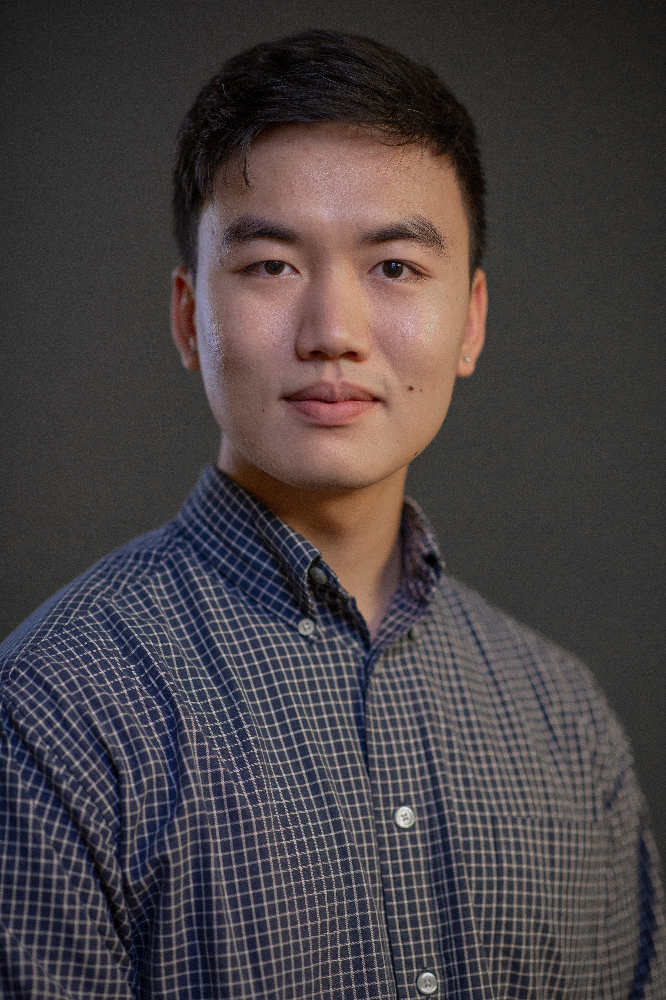

Contact me!

Personal Inquiries:
<a href="mailto: yavrob@gmail.com"> yavrob@gmail.com </a>

Work:
<a href="mailto: robert.yav@evc.edu"> robert.yav@evc.edu </a>

Academic:
<a href="mailto: robert.yav@sjsu.edu"> robert.yav@sjsu.edu </a>

TODO: Add font sizes to every paragraph, add pictures and more information for each project, and fix coloring and formatting for each section header

I am currently seeking internship positions in Data Science, Data Engineering, Data Analytics or other Statistics-adjacent roles!

## Introduction

Applied mathematician and statistician pursuing a master's degree, with a focus on machine learning, data science, and statistical modeling. Seeking internship opportunities in research and data science to apply coursework and project experience to real-world problems. I graduated from San Jose State University with a B.S. in Applied Mathematics with a concentration in Statistics and a minor in Computer Science.

## Present

### {height="30"} Evergreen Valley College

#### Math Lab Lead, Instructional Assistant

Currently, I work with the future generation of engineers in the Math and Science Resource Center at Evergreen Valley College. Tuesday, Wednesday, and Thursday, find me at MS-112B in my usual corner 1:00-8:00PM. (10:30-5:30PM in the summer) Tutoring in Calculus I-III (MATH 71-73), Differential Equations (MATH 78), and Statistics (STAT C1000).

My schedule is subject to changes every semester as I move it around for schooling.

### {height="30"} San Jose State University

#### MS Statistics

Currently attending San Jose State University, in Fall 2026, my course load includes Classification (MATH 251 MW 1:30-2:45PM) and Multivariate Analysis (MATH 257 MW 12:00-1:15PM).

## Skills

 Statistical Methods 

 Regression (OLS, LASSO), ANOVA, Friedman, cross-validation

 Machine Learning 

 Random Forest, Support Vector Machine, XGBoost, Logistic Regression, NLP (spaCy)

 Languages & Tools 

 Python (NumPy, Pandas, Scikit-learn, matplotlib), R (tidyverse, ggpubr, caret), SQL, Java, LaTeX, Excel, Quarto 

 Dimensionality Reduction 

 PCA, t-SNE, UMAP - Computer vision Class imbalance handling via SMOTE and image augmentation 

## Projects
### Human vs AI Art Perception: Replication Analysis [Spring 2026]{class="dates"}

Wrangled a 60-participant x 319-column survey dataset on AI art perception from wide to long format using R tidyverse. Audited and reanalyzed the study's Friedman Test and Within-Factors Repeated Measures ANOVA, uncovering dataset mislabeling through systematic comparison of descriptive statistics with ggpubr.

### Traffic Sign Classification [Spring 2026]{class="dates"}

Built a computer vision classification pipeline on the LISA Traffic Sign dataset. Addressed class imbalance via image augmentation and SMOTE, then compared PCA, t-SNE, and UMAP dimensionality reduction across Random Forest, SVM, Naive Bayes, and XGBoost classifiers.

### Predicting BMI from Screentime in Chinese Adolescents [Fall 2025]{class="dates"}

Applied OLS regression, LASSO, and variable transformations to predict adolescent BMI from screentime and demographic predictors using the Chinese National Health Survey dataset. Compared model accuracy via k-fold cross-validation with RMSE, $R^2$, and adjusted RMSE.

### Natural Disaster Tweet Classification [2023]{class="dates"}

Led a Machine Learning Club team to classify whether social media posts describe real natural disasters. Applied NLP preprocessing (spaCy lemmatization and tokenization) and compared Multinomial Naive Bayes, Logistic Regression, KNN, Decision Trees, Random Forests, SVM, and Gradient Boosting.

## Experience
### Math Lab Lead - Instructional Support Assistant [2024-Present]{class="dates"}

Leading the Math, Science & Engineering Resource Center, independently extending lab hours into the evening. Collaborating with staff, professors, and student tutors to maintain education standards and proctoring exams.

### Instructional Student Assistant [2022-2023]{class="dates"}

Independently facilitated workshops for MATH 70X (Mathematics for Business) and MATH 30X (Calculus I), improving consistency across course sections under head professors.

## Education

### MS Statistics [Expected Graduatation: May 2028]{class="dates"}

 San Jose State University 

Courses Taken: Stochastic Processes Design and Analysis of Experiments Mathematical Data Visualization Regression Theory
In Progress: Multivariate Analysis Classification

### BS Applied Mathematics: Statistics, Minor in Computer Science [Graduated: May 2023]{class="dates"}

 San Jose State University 

Courses Taken: Probability & Statistics I-II Mathematical Statistics Numerical Analysis & Scientific Computing Linear and Nonlinear Optimization Mathematical Modeling Data Structures & Algorithms Fundamentals of Data Science Programming in R Python & SQL Object-Oriented Programming Combinatorics
